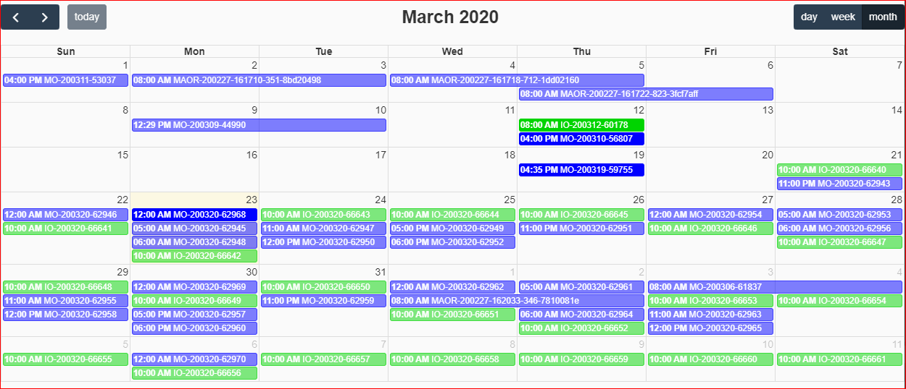
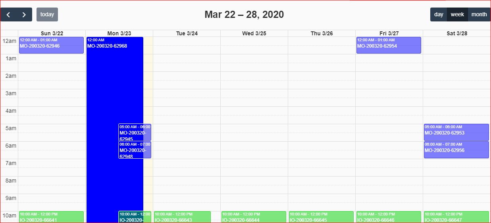

FullCalendar for OpenUI 5
===
## Description
The goal of this poject is to create a UI5 Caelndar library based on [FullCalendar](https://fullcalendar.io/).

The resources of FullCalendar

* [Documentation](https://fullcalendar.io/docs#toc)

## How To

### uia.fullcalendar.EventCalendar

TBD...

### uia.fullcalendar.EventSourceCalendar

View:
```xml
<EventSourceCalendar
        id="calendar"
        openEvent="true"
        aspectRatio="4"
        eventsFetch="onQueryEvents" />
```

Controller:

The structure of the event is [EventObject](https://fullcalendar.io/docs/event-object) of FullCalendar.


```js
onQueryEvents: funciton(oEvent) {
  // objects of FullCalendar
  var fetchInfo = oEvent.getParameter("fetchInfo");
  var successCallback = oEvent.getParameter("successCallback");

  // date period the calendar is displaying currently
  var from: fetchInfo.start.toDateTimeString(),
  var to: fetchInfo.end.toDateTimeString(),

  // prepare events
  var events = [];
  events.push({
    id: ...,
    title: ...,
    start: ...,
    end: ...,
    textColor: ...,
    backgroundColor: ...,
    borderColor: ...,
    url: ...
  });

  // update to the calendar
  successCallback(events);
}
```

## Examples

* DayMonth

  

* TimeWeek

  

## Copyright and License

Licensed under the Apache License, Version 2.0 (the "License");
you may not use this file except in compliance with the License.
You may obtain a copy of the License at

[http://www.apache.org/licenses/LICENSE-2.0](http://www.apache.org/licenses/LICENSE-2.0)

Unless required by applicable law or agreed to in writing, software
distributed under the License is distributed on an "AS IS" BASIS,
WITHOUT WARRANTIES OR CONDITIONS OF ANY KIND, either express or implied.
See the License for the specific language governing permissions and
limitations under the License.
